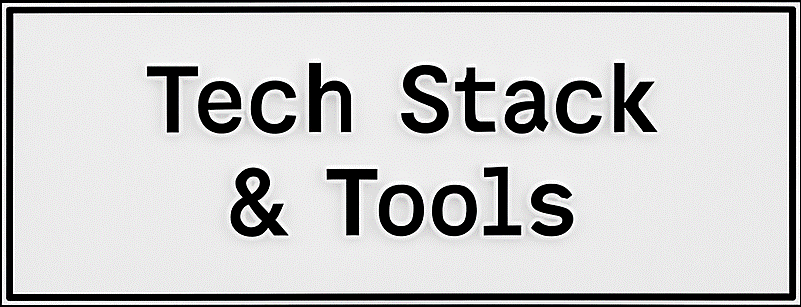

<div align="center">
  <h3 style="font-weight:500; color:#e0e0e0;">Minimalist Developer &nbsp;|&nbsp; Linux Power User &nbsp;|&nbsp; Secure Infra Enthusiast</h3>
  <p style="max-width: 600px; color: #aaa; font-size: 14px;">
    Focused on building clean, secure, and modular software systems with a love for Linux, self-hosting, and minimalism.
  </p>
</div>

---



<div align="center">
    
  <br />
  
  
  
  
  
  
</div>

---


---

### 📌 About Me

```python
  class Developer:
      def __init__(self):
          self.name = "Surya"
          self.focus = ["Minimalism", "Security", "Clean UX"]
          self.stack = [
              "HTML", "CSS", "JavaScript", "C", "Python",
              "Docker", "QEMU", "Neovim", "Hyprland", "Arch Linux"
          ]
          self.is_building = True
          self.learn_mode = "Always On"
  
      def introduce(self):
          print(f"Hi, I'm {self.name}.")
          print("I build sleek, self-hosted systems.")
          print("I live in the terminal, but think like a designer.")
          print(f"Tech Stack: {', '.join(self.stack[:5])} ... and more.")
          print("Always learning. Always refining.")
  
  dev = Developer()
  dev.introduce()
